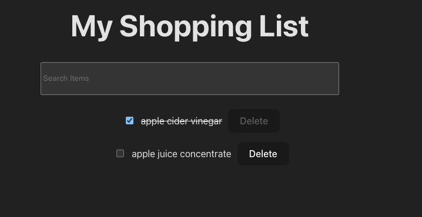

# Shopping List

A simple shopping list todo apps

## Requirements

- Entering more than two characters in the input should show a list of partially matching items (starting with the same characters)
- Clicking an item in the list of partially matching items should add it to the list
- Adding the same item multiple times is allowed
- Pressing the 'X' next to an item should delete it from the list
- Pressing the '✓' next to an item should check it off (i.e. strikethrough text and partially grey out text/buttons)
- Pressing the '✓' next to a checked-off item should uncheck it again

## API endpoints

### Find partially matching items

- **Method:** `GET`
- **URL:** `https://api.frontendeval.com/fake/food/:food`
- **Example request URL:** `https://api.frontendeval.com/fake/food/mi`
- **Example response:** `['milk', 'milkshake', 'mint', 'mixed herbs']`
- **Notes:** Only accepts items with a minimum of two characters (e.g. 'mi' is fine, 'm' will return an empty array)

## Demo

